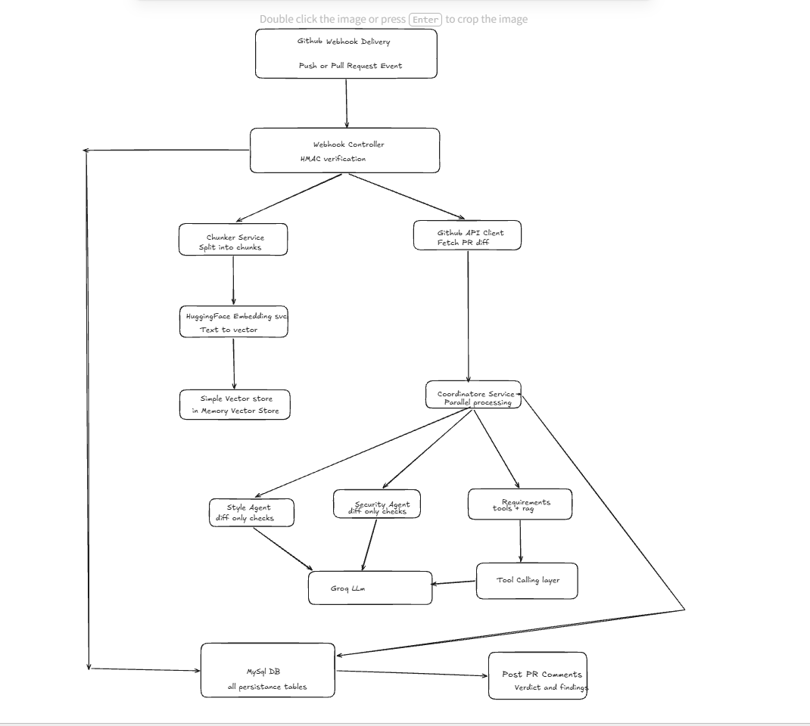
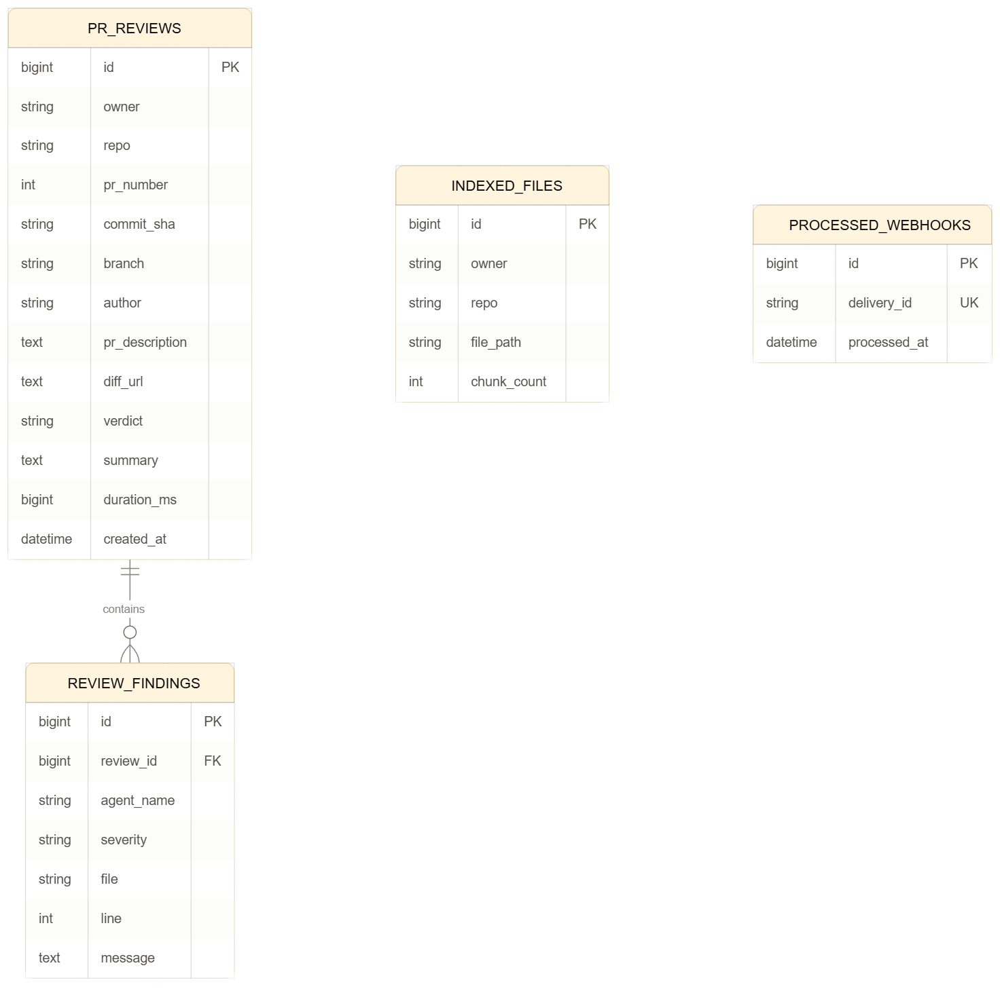

MultiAgentForPR:

An AI-powered multi-agent system that automatically reviews GitHub pull requests. When a PR is opened, three specialized AI agents analyze it in parallel — style, security, and requirement correctness — and post a merged verdict back as a PR comment, in under 2 seconds.

Problem:

Manually reviewing pull requests for style, security, and correctness is slow and inconsistent between reviewers. Engineers spend real time on checks that a system can do automatically and consistently, every single time.

Solution:

This system triggers on every PR event via GitHub webhooks. Three specialist AI agents — each scoped to a single concern — analyze the diff in parallel. A Coordinator agent merges their findings into one verdict (APPROVE, COMMENT, or REQUEST_CHANGES) and posts it as a formatted comment directly on the PR, giving the human reviewer a strong first pass instantly.

Architecture:

Request flow: GitHub webhook → signature verification → idempotency check → repository indexing (RAG) → parallel agent execution → verdict merge → persistence → metrics → PR comment.

Architecture Diagram:

DB diagram:

Agents:

Style agent — naming, formatting, convention issues (diff-only, no external context needed)
Security agent — injection risks, hardcoded secrets, unsafe patterns (diff-only)
Requirements agent — checks whether the diff actually fulfills the PR description. Uses agentic tool-calling to pull additional repository context on demand (full file contents, README, or a vector similarity search across the indexed codebase) when the diff alone isn't enough

Why tool-calling instead of a hand-built retrieval pipeline: Spring AI's native tool-calling already lets the LLM decide, mid-reasoning, whether it needs more context and which tool to call. Building a separate planner/reflection layer on top would duplicate a decision-making capability that already exists.

Why vector search on top of that: keyword-based tools only work if the agent knows the right filename or term to search for. If related code uses different terminology than the diff, keyword search misses it — vector similarity search finds semantically related code even without exact overlap.

Key Engineering Decisions:

Parallel execution on a dedicated thread pool — agents run via CompletableFuture on a custom ThreadPoolTaskExecutor, isolating AI workload from the JVM's shared ForkJoinPool.commonPool()
Per-agent timeouts — each future is bounded (20s) with graceful degradation to an empty result, so one slow agent can't block the entire review
Resilience4j circuit breaker + Spring Retry — retry handles a single call's transient failure; the circuit breaker tracks failure rate across calls and stops hitting a provider that's clearly down, instead of wasting retries against it
Idempotent webhook processing — GitHub's X-GitHub-Delivery header is claimed via an atomic database INSERT against a unique constraint, preventing duplicate PR comments from GitHub's at-least-once delivery retries
Incremental RAG indexing — full repository index on first contact with a repo; every subsequent push re-embeds only the files that actually changed, using the push payload's added/modified/removed file lists
Normalized schema — findings live in their own table (review_findings) with a foreign key back to pr_reviews, enabling indexed queries like "all CRITICAL findings this month" instead of parsing a JSON blob
Full observability — Micrometer metrics (review latency, per-agent duration, failure/retry counts, circuit breaker state) exposed to Prometheus and visualized in Grafana

Tech Stack:

Core: Java 17, Spring Boot 3, Spring AI, Maven
AI: Groq (llama3-8b-8192) for chat, HuggingFace Inference API for embeddings
Persistence: MySQL, Spring Data JPA
Vector search: Spring AI SimpleVectorStore
Resilience: Spring Retry, Resilience4j Circuit Breaker
Integration: GitHub REST API, GitHub Webhooks (HMAC-SHA256 verified)
Observability: Micrometer, Prometheus, Grafana
API docs: springdoc-openapi (Swagger UI)
Deployment: Docker, Railway

API Documentation:

Interactive API docs available at /swagger-ui/index.html once running — every endpoint (individual agents, coordinator, review history) is testable directly from the browser.

Running Locally:

bash# Requires: JDK 17, Maven, MySQL running locally

# Set environment variables
set GROQ_API_KEY=your_key
set GITHUB_TOKEN=your_token
set GITHUB_WEBHOOK_SECRET=your_secret
set HUGGINGFACE_API_KEY=your_key
set DB_PASSWORD=your_db_password

# Run
mvnw spring-boot:run

To receive real GitHub webhook events locally, tunnel with ngrok:

bashngrok http 8080

Then register the forwarded URL + /webhooks/github as your repository's webhook payload URL.

Docker

bashdocker build -t multiagentforpr .
docker run -p 8080:8080 --env-file .env multiagentforpr

Known Limitations / Honest Notes

SimpleVectorStore runs in-memory; a production version would move to a persistent vector store (pgvector/Chroma) for durability and horizontal scale
Failed background jobs currently log and continue rather than routing to a dead-letter queue for retry/inspection
Token usage / cost-per-review tracking is not yet implemented
Single-tenant by design (one GitHub token, one webhook secret) — a multi-user version would need a proper GitHub App with per-installation OAuth instead of a personal access token

What This Project Demonstrates:

Multi-agent orchestration, agentic tool-calling and lightweight RAG, production resilience patterns (circuit breakers, retries, timeouts, idempotency), normalized relational schema design, and full-stack observability — built and hardened iteratively, including real debugging of Spring AI template-parsing bugs, HuggingFace API endpoint migrations, and concurrency-safe idempotency design.